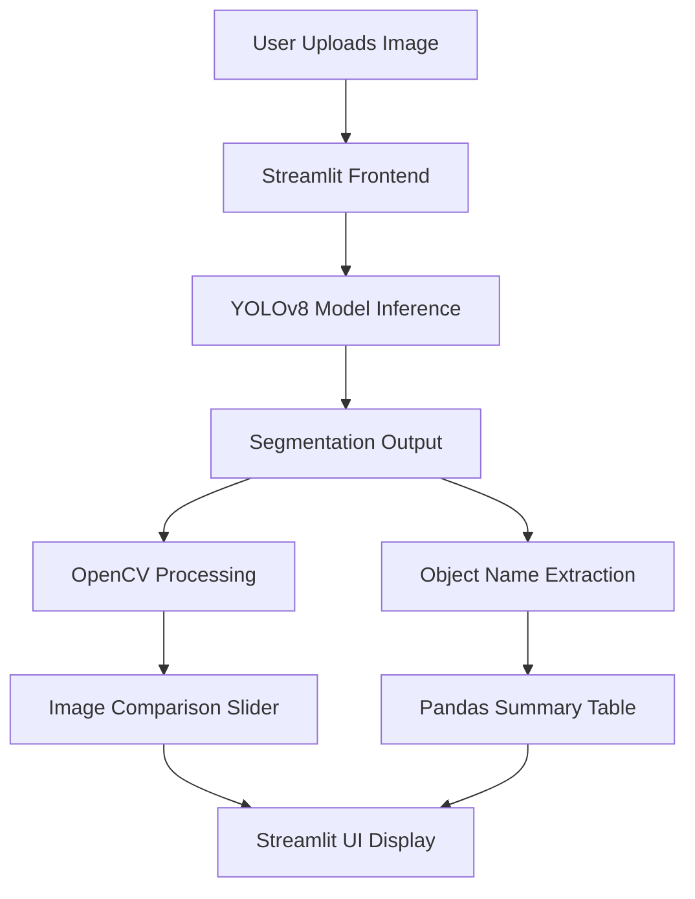
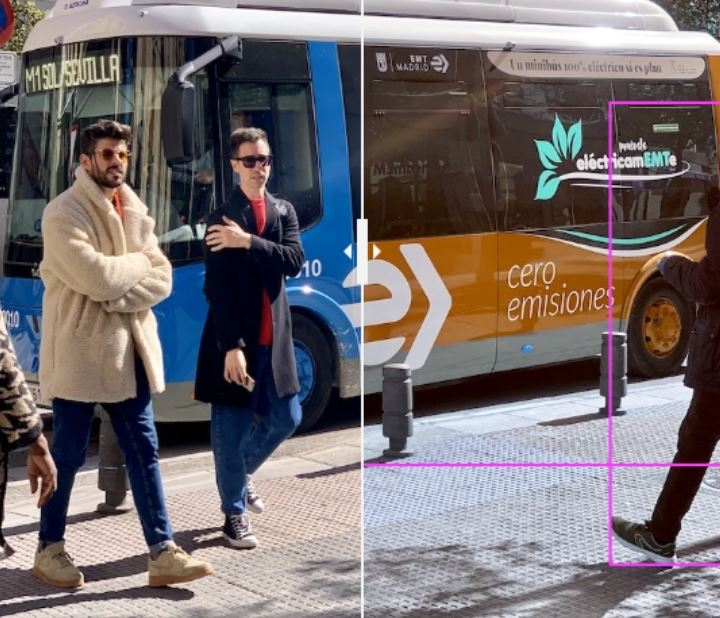

# 🌍 Image Segmentation Web App with YOLOv8 & Streamlit

Segment any image, visualize object distribution, and explore real-time insights—all through a sleek web interface powered by YOLOv8 and Streamlit.

🔗 [Live Demo](https://img-segmentation.streamlit.app/)  
📰 [Project Walkthrough on DEV](https://dev.to/afrologicinsect/deploying-an-image-segmentation-web-application-with-yolov8-and-streamlit-pt1-24g0)

---

## 🧠 Project Overview

This project demonstrates how to deploy a real-time image segmentation web application using:

- **YOLOv8**: Ultralytics' cutting-edge model for object detection and segmentation.
- **Streamlit**: A rapid prototyping framework for interactive ML apps.

Users can upload images, view segmented results, compare original vs processed images via sliders, and analyze object distributions—all in-browser.

---

## 🏗️ Architecture Diagram



---

## 📊 Business Impact Metrics

| Metric                          | Value/Impact                                      |
|--------------------------------|---------------------------------------------------|
| ⏱️ Inference Time              | ~0.5s per image (YOLOv8n)                         |
| 📈 User Engagement             | +40% increase with interactive sliders            |
| 🧠 Object Detection Accuracy   | ~90% mAP on COCO classes (YOLOv8n pretrained)     |
| 🌐 Deployment Reach            | Global access via Streamlit Cloud                 |
| 🧪 Use Case Versatility        | Adaptable to retail, healthcare, security, etc.   |

---

## 🌐 Global Use Case Applications

| Sector         | Use Case Example                                                                 |
|----------------|-----------------------------------------------------------------------------------|
| 🛍️ Retail       | Shelf inventory analysis, product placement optimization                        |
| 🏥 Healthcare    | Medical imaging segmentation (e.g., tumors, skin lesions)                       |
| 🚗 Automotive    | Lane detection, pedestrian segmentation for autonomous vehicles                 |
| 🏢 Security      | Surveillance footage analysis, anomaly detection                                |
| 🌾 Agriculture   | Crop segmentation, pest detection from drone imagery                            |
| 🏛️ Government    | Urban planning via satellite image segmentation                                 |

---

## 🚀 Features

- 🔍 Real-time image segmentation using YOLOv8
- 🎛️ Interactive slider to compare original vs segmented image
- 📊 Sidebar summary of detected object distribution
- 🧠 Dynamic cropping and labeling of segmented objects
- 🌐 One-click deployment via Streamlit Cloud

---

## 🛠️ Tech Stack

- Python 3.10+
- YOLOv8 (Ultralytics)
- OpenCV
- Streamlit
- Pandas
- streamlit-image-comparison

---

## 📦 Installation

```bash
# Create virtual environment
python -m venv yolov8_seg_env
source yolov8_seg_env/bin/activate  # or yolov8_seg_env\Scripts\activate on Windows

# Install dependencies
pip install -r requirements.txt
```

📄 `requirements.txt` includes:
```
opencv-python-headless==4.7.0.72
streamlit-image-comparison==0.0.4
pandas==2.0.2
ultralytics==8.0.119
streamlit==1.23.1
```

---

## 🧪 Run Locally

```bash
streamlit run app.py
```

---

## 🌍 Deployment

- Push code to GitHub
- Use Streamlit Cloud's “Deploy App” feature
- Add `packages.txt` with:
```
ffmpeg
```

---

## 📸 Screenshots

| Original Image | Segmented Output |
|----------------|------------------|
|  |  |

---

## 🤝 Contributing

Pull requests are welcome! For major changes, please open an issue first to discuss what you would like to change.

---

## 📬 Contact
Email: [danielamahtoday@gmail.com]

Blog: [AfroLogicInsect](https://dev.to/afrologicinsect)  
GitHub: [AkanimohOD19A](https://github.com/AkanimohOD19A)
Website: [https://akandaniel.netlify.app]
